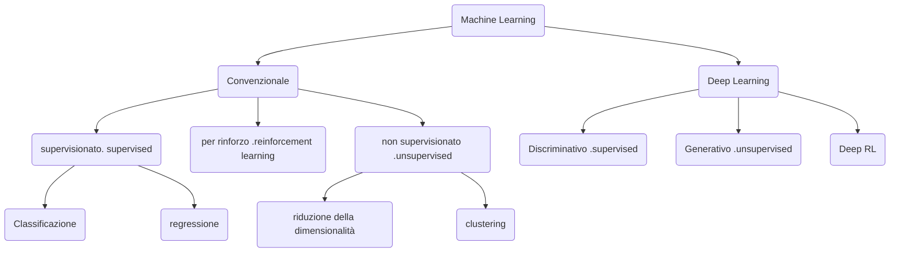

- **Machine learning**: metodi e algoritmi che permettono ad un software di apprendere dall'esperienza
- Gli algoritmi di apprendimento automatico apprendono dai dati. Ci sono diversi *tipi di apprendimento* che hanno scopi differenti, e molti algoritmi di apprendimento diversi
- La qualità dell'apprendimento tipicamente migliora all'aumentare del numero di esempi disponibili per l'addestramento (*il machine learning è particolarmente adatto ai "big data"*).
- Le [[Computazione Neurale#Reti neurali artificiali]] **Reti neurali artificiali** rappresentano una classe importante di algoritmi di apprendimento ma ci sono altri metodi, ad esempio metodi statici, metodi basati su kernel (*support vector machines*), metodi Bayesiani, etc...
- Il termine **_deep learning_** si riferisce alle reti neurali artificiali -> rappresenta lo stato dell'arte nell'apprendimento automatico ed è alla base della maggior parte dei recenti successi dell'IA
## Tre tipi di apprendimento
Immaginiamo un sistema (*biologico* o *artificiale*) che riceve una serie di input sensoriali: $x_1, x_2, x_3, x_4,...$
1. **Apprendimento supervisionato**: Viene fornito anche l'*output desiderato $y_1, y_2,...$*, e lo scopo è di imparare a **produrre l'output corretto** dato un nuovo input (*il più usato*)
2. **Apprendimento non supervisionato**: Lo scopo è di **costruire rappresentazioni** dell'input scoprendone le proprietà più importanti ed informative. Queste possono essere in seguito utilizzate per il ragionamento, la decisione, la comunicazione, etc..
3. **Apprendimento per rinforzo**: Il sistema produce *azioni* che hanno un effetto sul mondo, e riceve *rinforzi (o punizioni)* $r_1,r_2,...$ Lo scopo è di imparare ad agire in un modo che **massimizza il rinforzo** nel lungo termine (*usato per scacchi e go*)

## Apprendimento nelle reti neurali
- L'*apprendimento* in una rete neurale consiste nel trovare l'insieme di *pesi delle connessioni* che permette alla rete di produrre la risposta appropriata ad un certo input
- La sua forma più semplice di apprendimento è la *regola di Hebb*:
	- *se 2 neuroni collegati tra loro sono contemporanemente attivi, l'efficacia sinaptica della connessione viene aumentata*
- L'apprendimento hebbiano è biologicamente plausibile e corrisponde al fenomeno del *potenziamento a lungo termine* (Long Term Potentiation; **LTP**) scoperto da Kandel nel 1964
- Esistono *molti* algoritmi di apprendimento per reti neurali
### Apprendimento associativo: *la regola di Hebb*
*se 2 neuroni collegati tra loro sono contemporanemente attivi, l'efficacia sinaptica della connessione viene aumentata*
Formalmente se vogliamo associare un pattern di input $x$ con un pattern di output $y$
![[Screenshot 2024-03-14 alle 10.37.15.png]]
Nella sua forma originale, la regola può solo rinforzare le connessioni; inoltre i valori dei pesi non hanno un limite. Varianti alla regola di Hebb superano questi limiti (es. regola della covarianza per le reti di *Hopfield*)
**NB**: *Regole di apprendimento di tipo hebbiano sono utilizzate più spesso nel contesto dell'apprendimento ==non== supervisionato*.
### Apprendimento nelle reti neurali: *aspetti generali*
- Valori iniziali dei pesi sinaptici vengono assegnati in modo *casuale* (es. tra $-0.1$ e $+0.1$)
- Presentazione ripetuta dai pattern di addestramento.
	- *Apprendimento supervisionato*: **input + target** (*output desiderato*)
	- *Apprendimento non-supervisionato*: solo **input**
- L'apprendimento consiste nella modifica dei pesi, ovvero il calcolo di $\Delta w$ rispetto a $w$ precedente. L'aggiornamento può avvenire dopo ogni ==patter== (*on-line learning*) oppure dopo ogni ==epoca== di apprendimento (*batch learning*)
- *Per non stravolgere o cancellare le conoscenze precedentemente apprese*, viene utilizzata solo una frazione della modifica sinaptica calcolata, definita tramite la costante $\eta$ - **learning rate** (tasso di apprendimento) Quindi: $w^{t}_{ij} = w^{t-1}_{ij} + \eta \Delta w^{t}_{ij}$ 
## Reti neurali e memoria
*Si può dire che le reti memorizzano ciò che apprendono? Che tipi di memoria sono presenti in una rete neurale?*
- Una rete non contiene una sorta di magazzino di memoria e neppure una `<<traccia>>`. I *pesi delle connessioni (pesi sinaptici)* rappresentano comunque le ==conoscenze a lungo termine==, perchè non si cancellano e si modificano (gradualmente) solo se c'è ulteriore apprendimento.
- L'*attivazione dei neuroni* è invece un fenomeno temporaneo, è specifico per lo stimolo presentato e si esaurisce con la sua scomparsa. Tuttavia, se l'attivazione non cessa bruscamente, può influenzare l'elaborazione dello stimolo successivo (processo alla base dei fenomeni di *priming*)
- Alcuni compiti cognitivi richiedono di ricordare per breve tempo informazioni che non sono più presenti utilizzando la ==memoria di lavoro o a breve termine==. In una rete neurale questo si può realizzare *mantenendo attivi determinati neuroni anche quando l'input non è più presente.*
#### Il problema dell'interferenza
Il *compito di apprendimento associativo AB-AC* porta alla luce il problema dell'interferenza nella memoria:
- Vi sono 2 liste di coppie di parole
	- *lista AB*, ogni coppia della lista è costituita da una parola del gruppo A e da una parola del gruppo B
	- *lista AC*, ogni coppia della lista è costituita da una parola del gruppo A e da una parola del gruppo C
- I partecipanti dopo aver studiato la lista AB devono rievocare la parola B appropriata per ogni parola A; poi studiano la lista AC e vengono interrogati su entrambe le liste
![[Screenshot 2024-03-14 alle 12.43.34.png]]
#### Interferenza catastrofica nelle reti neurali
Se una rete neurale viene sottoposta al compito di apprendimento associativo AB-AC si ottiene un effetto di interferenza ancora maggiore che negli esseri umani. Questo fenomeno è chiamato di «*interferenza catastrofica*» (*catastrophic forgetting*)
![[Screenshot 2024-03-14 alle 12.48.14.png]]
**Due fattori determinano l'interferenza in una rete neurale:**
- Il *grado di sovrapposizione* delle rappresentazioni
	- La sovrapposizione delle rappresentazioni, d'altra parte, è utile perchè permette l'*integrazione* e la *generalizzazione* delle conoscenze
- Il *tasso di apprendimento* elevato
	- Anche la *rapidità dell'apprendimento*, permessa da un tasso di apprendimento elevato è ovviamente utile.
Il cervello umano ha risolto questo problema evolvendo 2 sistemi di apprendimento *separati* e *complementari*
### 2 sistemi complementari di apprendimento e memoria
- **Ippocampo**
	- specializzato nell'apprendimento rapido e non soggetto a interferenza
	- rappresentazioni sparse
- **Neocorteccia**
	- apprende lentamente e integra gradualmente le esperienze estraendo le conoscenze generali sul mondo
	- *Rappresentazioni distribuite*
