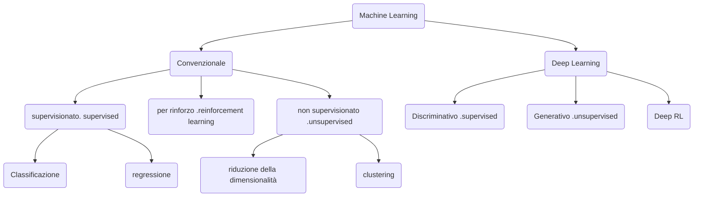

- **Machine learning**: metodi e algoritmi che permettono ad un software di apprendere dall'esperienza
- Gli algoritmi di apprendimento automatico apprendono dai dati. Ci sono diversi *tipi di apprendimento* che hanno scopi differenti, e molti algoritmi di apprendimento diversi
- La qualità dell'apprendimento tipicamente migliora all'aumentare del numero di esempi disponibili per l'addestramento (*il machine learning è particolarmente adatto ai "big data"*).
- Le [[Computazione Neurale#Reti neurali artificiali]] **Reti neurali artificiali** rappresentano una classe importante di algoritmi di apprendimento ma ci sono altri metodi, ad esempio metodi statici, metodi basati su kernel (*support vector machines*), metodi Bayesiani, etc...
- Il termine **_deep learning_** si riferisce alle reti neurali artificiali -> rappresenta lo stato dell'arte nell'apprendimento automatico ed è alla base della maggior parte dei recenti successi dell'IA
## Tre tipi di apprendimento
Immaginiamo un sistema (*biologico* o *artificiale*) che riceve una serie di input sensoriali: $x_1, x_2, x_3, x_4,...$
1. **Apprendimento supervisionato**: Viene fornito anche l'*output desiderato $y_1, y_2,...$*, e lo scopo è di imparare a **produrre l'output corretto** dato un nuovo input (*il più usato*)
2. **Apprendimento non supervisionato**: Lo scopo è di **costruire rappresentazioni** dell'input scoprendone le proprietà più importanti ed informative. Queste possono essere in seguito utilizzate per il ragionamento, la decisione, la comunicazione, etc..
3. **Apprendimento per rinforzo**: Il sistema produce *azioni* che hanno un effetto sul mondo, e riceve *rinforzi (o punizioni)* $r_1,r_2,...$ Lo scopo è di imparare ad agire in un modo che **massimizza il rinforzo** nel lungo termine (*usato per scacchi e go*)
4. 

